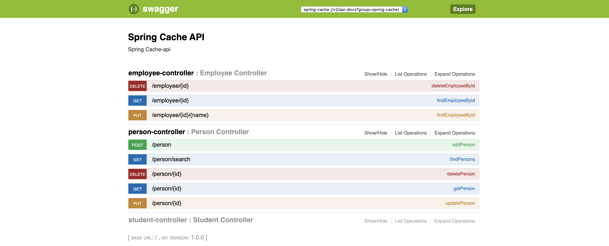
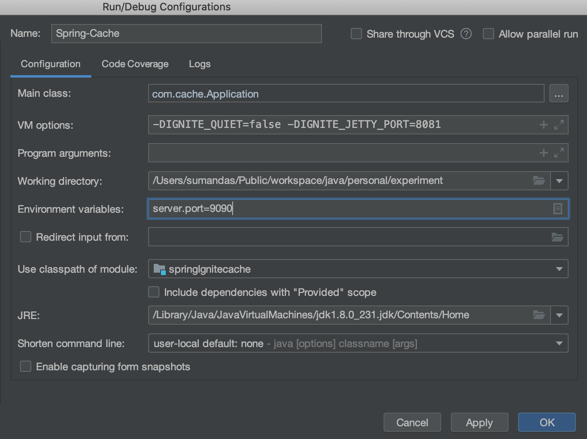

# Sample Apache Ignite - Spring Boot application
The purpose of this project is to demonstrate Ignite as a Cache Provider for Spring Cache in one package.

# How to build and run

Java 8 lambdas are used here and there and thus the project can be compiled only with JDK 8 `javac`.
To compile just do `mvn clean install`.
To run a three node cluster excute the following:
```
java -DIGNITE_QUIET=false -DIGNITE_JETTY_PORT=8081 -jar target/ignite-cache*.jar
```

You can also use the Swagger-ui.html to test the application.





for more detailed technical information please check my post :

